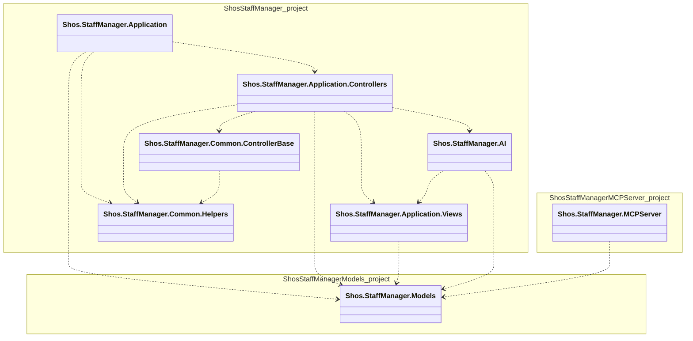
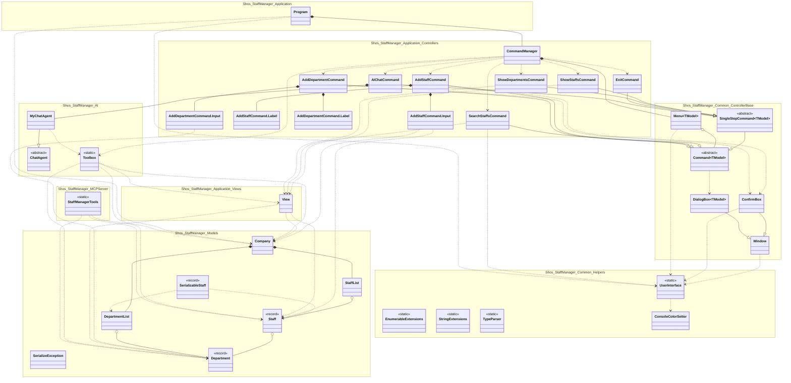

# Class Diagrams

## Namespace Diagram

ソリューション内の全ての namespace とその依存関係を示すクラス図

```mermaid
classDiagram
    namespace ShosStaffManager_project {
        class App["Shos.StaffManager.Application"]
        class Ctrl["Shos.StaffManager.Application.Controllers"]
        class Views["Shos.StaffManager.Application.Views"]
        class AI["Shos.StaffManager.AI"]
        class Helpers["Shos.StaffManager.Common.Helpers"]
        class CtrlBase["Shos.StaffManager.Common.ControllerBase"]
    }

    namespace ShosStaffManagerModels_project {
        class Models["Shos.StaffManager.Models"]
    }

    namespace ShosStaffManagerMCPServer_project {
        class MCP["Shos.StaffManager.MCPServer"]
    }

    App ..> Ctrl
    App ..> Helpers
    App ..> Models

    Ctrl ..> AI
    Ctrl ..> Views
    Ctrl ..> CtrlBase
    Ctrl ..> Helpers
    Ctrl ..> Models

    Views ..> Models

    CtrlBase ..> Helpers

    AI ..> Views
    AI ..> Models

    MCP ..> Models
```

## Class Diagram

ソリューション内の全ての class, record とその関係を示すクラス図

```mermaid
classDiagram
    namespace Shos_StaffManager_Models {
        class SerializeException
        class Department {
            <<record>>
        }
        class Staff {
            <<record>>
        }
        class SerializableStaff {
            <<record>>
        }
        class DepartmentList
        class StaffList
        class Company
    }

    namespace Shos_StaffManager_Application {
        class Program
    }

    namespace Shos_StaffManager_Application_Controllers {
        class ShowStaffsCommand
        class SearchStaffsCommand
        class ShowDepartmentsCommand
        class AddStaffCommand
        class AddStaffLabel["AddStaffCommand.Label"]
        class AddStaffInput["AddStaffCommand.Input"]
        class AddDepartmentCommand
        class AddDepartmentLabel["AddDepartmentCommand.Label"]
        class AddDepartmentInput["AddDepartmentCommand.Input"]
        class ExitCommand
        class AIChatCommand
        class CommandManager
    }

    namespace Shos_StaffManager_Application_Views {
        class View
    }

    namespace Shos_StaffManager_Common_ControllerBase {
        class Window
        class ConfirmBox
        class DialogBox~TModel~
        class Command~TModel~ {
            <<abstract>>
        }
        class SingleStepCommand~TModel~ {
            <<abstract>>
        }
        class Menu~TModel~
    }

    namespace Shos_StaffManager_Common_Helpers {
        class EnumerableExtensions {
            <<static>>
        }
        class StringExtensions {
            <<static>>
        }
        class TypeParser {
            <<static>>
        }
        class ConsoleColorSetter
        class UserInterface {
            <<static>>
        }
    }

    namespace Shos_StaffManager_AI {
        class ChatAgent {
            <<abstract>>
        }
        class MyChatAgent
        class Toolbox {
            <<static>>
        }
    }

    namespace Shos_StaffManager_MCPServer {
        class StaffManagerTools {
            <<static>>
        }
    }

    %% Models 内の関係
    Staff        o-- Department
    DepartmentList o-- Department
    StaffList    o-- Staff
    Company      *-- DepartmentList
    Company      *-- StaffList
    SerializableStaff ..> Staff
    SerializableStaff ..> DepartmentList

    %% Common.ControllerBase 内の関係
    ConfirmBox        --|> Window
    DialogBox~TModel~ --|> Window
    SingleStepCommand~TModel~ --|> Command~TModel~
    Command~TModel~   ..> DialogBox~TModel~
    Menu~TModel~      o-- Command~TModel~
    Window            ..> UserInterface
    ConfirmBox        ..> UserInterface
    Menu~TModel~      ..> UserInterface

    %% Application.Controllers 内・他 namespace への関係
    ShowStaffsCommand      --|> SingleStepCommand~Company~
    ShowDepartmentsCommand --|> SingleStepCommand~Company~
    ExitCommand            --|> SingleStepCommand~Company~
    AIChatCommand          --|> SingleStepCommand~Company~
    SearchStaffsCommand    --|> Command~Company~
    AddStaffCommand        --|> Command~Company~
    AddDepartmentCommand   --|> Command~Company~

    AddStaffCommand      *-- AddStaffLabel
    AddStaffCommand      *-- AddStaffInput
    AddStaffCommand      ..> ConfirmBox
    AddStaffInput        ..> Staff
    AddStaffInput        ..> Company

    AddDepartmentCommand *-- AddDepartmentLabel
    AddDepartmentCommand *-- AddDepartmentInput
    AddDepartmentCommand ..> ConfirmBox
    AddDepartmentInput   ..> Department

    ShowStaffsCommand      ..> View
    SearchStaffsCommand    ..> View
    SearchStaffsCommand    ..> UserInterface
    ShowDepartmentsCommand ..> View
    AIChatCommand          *-- MyChatAgent

    CommandManager *-- Menu~Company~
    CommandManager ..> ShowStaffsCommand
    CommandManager ..> SearchStaffsCommand
    CommandManager ..> AddStaffCommand
    CommandManager ..> ShowDepartmentsCommand
    CommandManager ..> AddDepartmentCommand
    CommandManager ..> AIChatCommand
    CommandManager ..> ExitCommand
    CommandManager ..> Toolbox

    %% Application.Views 内の関係
    View ..> Department
    View ..> Staff
    View ..> Company

    %% AI 内の関係
    MyChatAgent --|> ChatAgent
    MyChatAgent ..> Toolbox
    Toolbox     ..> Company
    Toolbox     ..> Department
    Toolbox     ..> Staff
    Toolbox     ..> View

    %% Application 内の関係
    Program *-- CommandManager
    Program ..> Company
    Program ..> UserInterface

    %% Common.Helpers 内の関係
    UserInterface ..> ConsoleColorSetter

    %% MCPServer 内の関係
    StaffManagerTools ..> Company
    StaffManagerTools ..> Department
    StaffManagerTools ..> Staff
```
