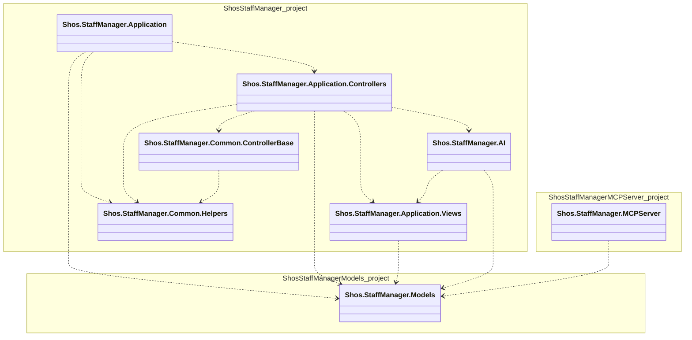

# Class Diagrams

## Namespace Diagram

ソリューション内の全ての namespace とその依存関係を示すクラス図

```mermaid
classDiagram
    namespace ShosStaffManager_project {
        class App["Shos.StaffManager.Application"]
        class Ctrl["Shos.StaffManager.Application.Controllers"]
        class Views["Shos.StaffManager.Application.Views"]
        class AI["Shos.StaffManager.AI"]
        class Helpers["Shos.StaffManager.Common.Helpers"]
        class CtrlBase["Shos.StaffManager.Common.ControllerBase"]
    }

    namespace ShosStaffManagerModels_project {
        class Models["Shos.StaffManager.Models"]
    }

    namespace ShosStaffManagerMCPServer_project {
        class MCP["Shos.StaffManager.MCPServer"]
    }

    App ..> Ctrl
    App ..> Helpers
    App ..> Models

    Ctrl ..> AI
    Ctrl ..> Views
    Ctrl ..> CtrlBase
    Ctrl ..> Helpers
    Ctrl ..> Models

    Views ..> Models

    CtrlBase ..> Helpers

    AI ..> Views
    AI ..> Models

    MCP ..> Models
```
