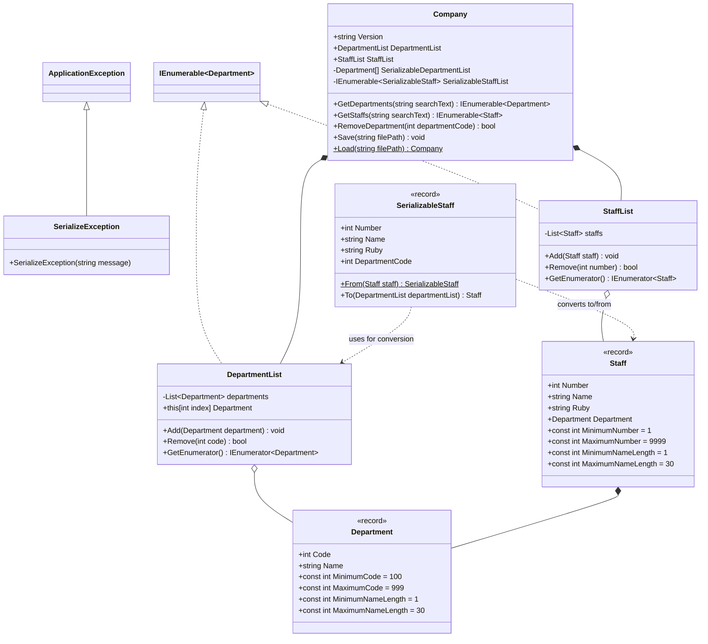
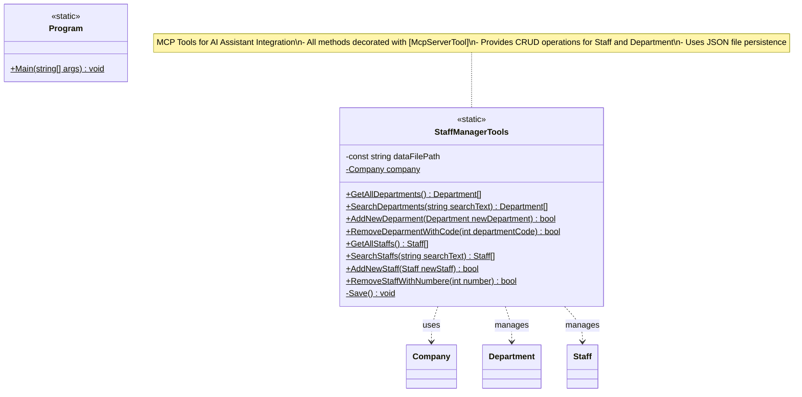

# Shos.StaffManager

A console-based staff management system built with .NET 9.0 and C#. This application provides an interactive command-line interface for managing staff members and departments with Japanese language support.

## Learning Value for Programming Students

This sample application serves as an excellent educational resource for developers learning modern C# and .NET development practices. The codebase demonstrates numerous important programming concepts and patterns:

### 🎯 **Core Programming Concepts**
- **Object-Oriented Programming**: Classes, inheritance, encapsulation, and polymorphism
- **Modern C# Features**: Records, nullable reference types, pattern matching, and collection expressions
- **SOLID Principles**: Single responsibility, dependency inversion, and interface segregation
- **Generic Programming**: Generic classes, methods, and type constraints

### 🏗️ **Software Architecture & Design Patterns**
- **Model-View-Controller (MVC)**: Clean separation between data, presentation, and business logic
- **Command Pattern**: Menu operations implemented as reusable command objects
- **Factory Pattern**: Command creation and management
- **Strategy Pattern**: Different validation rules and processing strategies
- **Template Method Pattern**: Base classes with customizable behavior

### 📊 **Data Management & Serialization**
- **JSON Serialization**: Custom serialization with `System.Text.Json`
- **Data Transfer Objects (DTOs)**: Separate serializable models for persistence
- **File I/O Operations**: UTF-8 encoding and error handling
- **Data Validation**: Input validation with custom rules and error messages

### 🔧 **Advanced C# Techniques**
- **Extension Methods**: String operations and type parsing utilities
- **Reflection**: Dynamic type parsing and method invocation
- **LINQ**: Functional query operations and data transformation
- **Tuple Deconstruction**: Modern return patterns with named tuples
- **Resource Management**: `IDisposable` pattern for console color management

### 🌐 **Internationalization & Localization**
- **Unicode Support**: Proper handling of Japanese characters (Zenkaku/Hankaku)
- **Character Width Calculation**: Display formatting for mixed-width text
- **Text Normalization**: Unicode normalization for consistent input handling

### 🎨 **User Interface Design**
- **Console UI Patterns**: Menu systems, dialogs, and tabular data display
- **Input Validation**: Real-time validation with user-friendly error messages
- **State Management**: Multi-step wizards and repeatable operations
- **User Experience**: Confirmation dialogs and navigation patterns

### 🧪 **Best Practices Demonstrated**
- **Error Handling**: Try-catch blocks with specific exception types
- **Code Documentation**: Comprehensive XML documentation comments
- **Naming Conventions**: Clear, descriptive method and variable names
- **Code Organization**: Logical namespace structure and file organization
- **Type Safety**: Nullable reference types and null checking

### 🎓 **Skill Development Areas**

**Beginner Level:**
- Basic C# syntax and object-oriented concepts
- File I/O and data persistence
- Console application development
- Error handling fundamentals

**Intermediate Level:**
- Design patterns implementation
- Generic programming
- LINQ and functional programming concepts
- Custom serialization strategies

**Advanced Level:**
- Reflection and metaprogramming
- Advanced type system features
- Architectural patterns
- Performance optimization techniques
- **AI Integration**: Model Context Protocol (MCP) server development
- **Tool Design**: Creating AI-accessible tools and APIs

### 📚 **Educational Exercises**

Students can enhance their learning by:
1. **Adding new features**: Implement edit/delete operations for staff and departments
2. **Extending validation**: Add more complex business rules and validation logic
3. **Database integration**: Replace JSON storage with Entity Framework Core
4. **Testing**: Write unit tests for business logic and validation
5. **Localization**: Add support for multiple languages
6. **Performance**: Implement caching and async operations
7. **UI enhancement**: Add color coding, progress bars, or menu shortcuts
8. **MCP expansion**: Add new MCP tools for reporting and analytics
9. **AI integration**: Experiment with different AI assistants using the MCP server
10. **Protocol development**: Create custom MCP tools for specialized workflows

This codebase provides a realistic, well-structured example that bridges the gap between simple tutorials and complex enterprise applications, making it an ideal learning resource for developers at various skill levels.

## Features

### Core Functionality
- **Staff Management**: Add, list, and search staff members
- **Department Management**: Add and list organizational departments  
- **Search Capabilities**: Find staff by name, employee number, or department
- **Data Persistence**: Automatic JSON file storage with UTF-8 encoding
- **Japanese Support**: Full support for Japanese characters with proper display width calculation
- **MCP Integration**: Model Context Protocol server for AI assistant integration

### User Interface
- Interactive console menu system
- Tabular data display using [Shos.Console](https://www.nuget.org/packages/Shos.Console/) library
- Input validation with error messages
- Confirmation dialogs for data entry operations
- Repeatable commands for bulk operations

### AI Assistant Integration
- **MCP Server**: Exposes staff management functionality through Model Context Protocol
- **Tool-based Access**: AI assistants can directly manage staff and departments
- **Real-time Operations**: Add, remove, search, and list operations available via MCP tools

## Technical Architecture

### Design Patterns
- **Model-View-Controller (MVC)**: Clean separation of concerns
- **Command Pattern**: Menu operations implemented as commands
- **Repository Pattern**: JSON-based data persistence layer

### Class Diagrams

#### Shos.StaffManager.Models Project

The models project contains the core domain entities and data structures:



#### Shos.StaffManager Console Application

The main console application follows MVC architecture with command pattern:

```mermaid
classDiagram
    namespace Common.Helpers {
        class EnumerableExtensions {
            <<static>>
            +ForEach~TElement~(IEnumerable~TElement~ this, Action~TElement~ action)$
        }
        
        class StringExtensions {
            <<static>>
            +Width(string this)$ int
            +IsZenkaku(char this)$ bool
            +IsZenkaku(string this)$ bool
        }
        
        class TypeParser {
            <<static>>
            +Parse~T~(string this)$ T?
            +TryParse~T~(string this)$ (bool canParse, T? result)
            +Parse(Type this, string text)$ object?
            +TryParse(Type this, string text)$ (bool canParse, object? result)
        }
        
        class ConsoleColorSetter {
            -ConsoleColor oldForeground
            -ConsoleColor oldBackground
            +Foreground ConsoleColor
            +Background ConsoleColor
            +Dispose() void
        }
        
        class UserInterface {
            <<static>>
            +string CancelString
            +string ErrorHeader
            +Get~T~(string message, IEnumerable rules)$ (bool isAvailable, T? item)
            +GetMnemonic(string message, string mnemonics)$ (bool isAvailable, char mnemonic)
            +ShowPrompt(string message)$ void
            +ShowError(string message)$ void
            +Show(string message)$ void
        }
    }
    
    namespace Common.ControllersBase {
        class Window {
            <<abstract>>
            +string Title
            #ShowTitleBar(int separatorLength) void
            #ShowSeparator(int separatorLength)$ void
        }
        
        class ConfirmBox {
            +Show(string text, string message) bool
        }
        
        class DialogBox~TModel~ {
            +Func~TModel, bool~[] Steps
            +Show(TModel model) bool
        }
        
        class Command~TModel~ {
            <<abstract>>
            +enum CommandMode { Exit, Once, Repeat }
            +virtual CommandMode Mode
            +abstract string Title
            +virtual Func~TModel, bool~[] Steps
            +Run(TModel model) bool
        }
        
        class SingleStepCommand~TModel~ {
            <<abstract>>
            +Func~TModel, bool~[] Steps
            #abstract RunFeature(TModel model) bool
        }
        
        class Menu~TModel~ {
            -Dictionary~char, Command~TModel~~ commandTable
            +IEnumerable Commands
            +Select(string message) Command~TModel~?
        }
    }
    
    namespace Views {
        class View {
            <<static>>
            +Show(IEnumerable~Department~ departments)$ void
            +Show(IEnumerable~Staff~ staffs)$ void
            +ShowDepartments(Company company)$ void
            +ShowStaffs(Company company)$ void
            +ShowStaffs(Company company, string searchText)$ void
        }
    }
    
    namespace Controllers {
        class ShowStaffsCommand {
            +string Title
            #RunFeature(Company model) bool
        }
        
        class SearchStaffsCommand {
            +CommandMode Mode
            +string Title
            +Func~Company, bool~[] Steps
            -string searchString
        }
        
        class AddStaffCommand {
            +CommandMode Mode
            +string Title
            +Func~Company, bool~[] Steps
            -Input input
        }
        
        class AddDepartmentCommand {
            +CommandMode Mode
            +string Title
            +Func~Company, bool~[] Steps
            -Input input
        }
        
        class ShowDepartmentsCommand {
            +string Title
            #RunFeature(Company model) bool
        }
        
        class ExitCommand {
            +CommandMode Mode
            +string Title
            #RunFeature(Company model) bool
        }
        
        class CommandManager {
            -Menu~Company~ menu
            +Run(Company model) bool
            -Select() Command~Company~?
        }
        
        class Program {
            -const string dataFilePath
            -const string applicationName
            -Company company
            -CommandManager operationManager
            -Run() void
            -Load() bool
            -Save() bool
            +Main(string[] args)$ void
        }
    }
    
    IDisposable <|.. ConsoleColorSetter
    Window <|-- ConfirmBox
    Window <|-- DialogBox~TModel~
    Command~TModel~ <|-- SingleStepCommand~TModel~
    SingleStepCommand~Company~ <|-- ShowStaffsCommand
    Command~Company~ <|-- SearchStaffsCommand
    Command~Company~ <|-- AddStaffCommand
    Command~Company~ <|-- AddDepartmentCommand
    SingleStepCommand~Company~ <|-- ShowDepartmentsCommand
    SingleStepCommand~Company~ <|-- ExitCommand
    CommandManager o-- Menu~Company~
    Program *-- Company
    Program *-- CommandManager
```

#### Shos.StaffManager.MCPServer Project

The MCP server exposes staff management functionality to AI assistants:



### Project Structure
```
Shos.StaffManager/
├── Shos.StaffManager/          # Main console application
│   ├── Models/
│   │   ├── Staff.cs              # Staff record with validation
│   │   ├── Department.cs         # Department record  
│   │   ├── Company.cs            # Main data container
│   │   └── SerializableStaff.cs  # JSON serialization support
│   ├── Views/
│   │   └── View.cs               # Data display formatting
│   ├── Controllers/
│   │   ├── Commands/             # Menu command implementations
│   │   └── CommandManager.cs     # Command orchestration
│   ├── Common/
│   │   ├── Helpers/              # Utility classes
│   │   └── ControllersBase/      # Base UI components
│   └── Data/
│       └── FC.StaffManager.json  # Sample data file
├── Shos.StaffManager.Models/   # Shared data models library
└── Shos.StaffManager.MCPServer/ # MCP server for AI integration
    ├── Program.cs               # MCP server implementation
    └── StaffManagerTools.cs     # MCP tool definitions
```

### Data Model

#### Staff Record
- **Number**: Employee ID (1-9999)
- **Name**: Full name in Japanese (1-30 characters)
- **Ruby**: Phonetic reading (katakana)
- **Department**: Associated department object

#### Department Record  
- **Code**: Department code (100-999)
- **Name**: Department name (1-30 characters)

### Data Validation
- Staff numbers must be unique within 1-9999 range
- Department codes must be unique within 100-999 range
- Name fields have 1-30 character length limits
- Department references are validated on staff creation

## Shos.StaffManager.MCPServer

### What is MCP (Model Context Protocol)?

**Model Context Protocol (MCP)** is an open standard that enables secure connections between AI assistants and external data sources and tools. MCP allows AI assistants like Claude, ChatGPT, and others to access and interact with external systems through a standardized protocol, expanding their capabilities beyond their training data.

Key benefits of MCP:
- **Secure Integration**: Controlled access to external tools and data
- **Real-time Data**: Access to live, up-to-date information
- **Tool Execution**: AI assistants can perform actions on external systems
- **Standardized Protocol**: Consistent interface across different AI platforms

### MCP Server Component

The `Shos.StaffManager.MCPServer` project provides an MCP server that exposes the staff management system's functionality as tools that AI assistants can use. This allows AI assistants to directly interact with the staff management system without requiring manual console operations.

#### Available MCP Tools

The MCP server provides the following tools for AI assistants:

**Department Management:**
- `GetAllDepartments()` - Retrieve all departments
- `SearchDepartments(searchText)` - Search departments by keyword
- `AddNewDeparment(newDepartment)` - Add a new department
- `RemoveDeparmentWithCode(departmentCode)` - Remove a department by code

**Staff Management:**
- `GetAllStaffs()` - Retrieve all staff members
- `SearchStaffs(searchText)` - Search staff by keyword
- `AddNewStaff(newStaff)` - Add a new staff member
- `RemoveStaffWithNumbere(number)` - Remove a staff member by number

#### Setting Up the MCP Server

1. **Build the MCP Server**:
   ```bash
   dotnet build Shos.StaffManager.MCPServer
   ```

2. **Run with MCP Inspector** (for testing):
   ```bash
   npx @modelcontextprotocol/inspector dotnet run --project ./Shos.StaffManager.MCPServer/Shos.StaffManager.MCPServer.csproj
   ```

3. **Configure with Claude Desktop**:
   
   Edit your `claude_desktop_config.json` file:
   ```json
   {
     "mcpServers": {
       "StaffManagerTools": {
         "command": "[path-to-executable]\\Shos.StaffManager.MCPServer.exe"
       }
     }
   }
   ```

4. **Configure with Visual Studio Code**:
   
   Add to your VS Code MCP settings:
   ```json
   {
     "servers": {
       "MCPServer.Console": {
         "type": "stdio",
         "command": "dotnet",
         "args": [
           "run",
           "--project",
           "C:\\[project-folder]\\Shos.StaffManager.MCPServer.csproj"
         ]
       }
     }
   }
   ```

#### Use Cases for AI Integration

With the MCP server running, AI assistants can:
- **Answer questions** about staff and departments using live data
- **Generate reports** by querying and analyzing staff information
- **Perform bulk operations** like adding multiple staff members
- **Validate data integrity** by checking for duplicates or inconsistencies
- **Provide interactive assistance** for staff management tasks

This integration transforms the console-based staff management system into a powerful backend service that AI assistants can leverage for intelligent staff management operations.

## Requirements

### Console Application
- **.NET 9.0** or later
- **Shos.Console 1.1.5** (automatically installed via NuGet)

### MCP Server
- **.NET 9.0** or later
- **ModelContextProtocol 0.3.0-preview.3** (automatically installed via NuGet)
- **Microsoft.Extensions.Hosting 9.0.7** (automatically installed via NuGet)

## Installation & Setup

### Console Application

1. **Clone the repository**:
   ```bash
   git clone https://github.com/Fujiwo/Shos.StaffManager.git
   cd Shos.StaffManager
   ```

2. **Build the application**:
   ```bash
   dotnet build
   ```

3. **Run the console application**:
   ```bash
   dotnet run --project Shos.StaffManager
   ```

### MCP Server Setup

1. **Build the MCP server**:
   ```bash
   dotnet build Shos.StaffManager.MCPServer
   ```

2. **Test with MCP Inspector**:
   ```bash
   npx @modelcontextprotocol/inspector dotnet run --project Shos.StaffManager.MCPServer
   ```

3. **Configure your AI assistant** (see MCP Server section above for detailed configuration)

## Usage

### Main Menu Options
The application presents a Japanese menu with the following options:

- **(s) 社員一覧** - List all staff members
- **(f) 社員検索** - Search for staff members  
- **(a) 社員追加** - Add a new staff member
- **(d) 部署一覧** - List all departments
- **(e) 部署追加** - Add a new department
- **(x) 終了** - Exit the application

### Sample Operations

#### Adding a Department
1. Select **(e) 部署追加** from the main menu
2. Enter a department code (100-999)
3. Enter a department name (1-30 characters)
4. Confirm the addition

#### Adding a Staff Member
1. Select **(a) 社員追加** from the main menu  
2. Enter a staff number (1-9999)
3. Enter a staff name (1-30 characters)
4. Enter the phonetic reading (ruby)
5. Enter an existing department code
6. Confirm the addition

#### Searching for Staff
1. Select **(f) 社員検索** from the main menu
2. Enter a search term (name, number, or department)
3. View the filtered results
4. Repeat the search or return to the main menu

## Data Storage

### File Format
Data is stored in `FC.StaffManager.json` using UTF-8 encoding with pretty-printed JSON:

```json
{
  "SerializableDepartmentList": [
    {
      "Code": 114,
      "Name": "ウェブ開発部"
    }
  ],
  "SerializableStaffList": [
    {
      "Number": 2562,
      "Name": "森 誠", 
      "Ruby": "モリ マコト",
      "DepartmentCode": 114
    }
  ]
}
```

### Data Migration
The application automatically creates a new data file if none exists. Sample data is included in the `Data/` directory for testing purposes.

## Key Technologies

### Core Technologies
- **.NET 9.0**: Modern C# with latest language features
- **System.Text.Json**: High-performance JSON serialization
- **Shos.Console**: Enhanced console table formatting
- **Records**: Immutable data structures with validation
- **LINQ**: Functional query operations
- **UTF-8**: Full Unicode support for Japanese text

### MCP Integration
- **ModelContextProtocol**: Standard protocol for AI assistant tool integration
- **Microsoft.Extensions.Hosting**: .NET hosting model for the MCP server
- **Stdio Transport**: Standard input/output communication with AI assistants

## Development Features

### Error Handling
- Comprehensive input validation
- Graceful error recovery
- User-friendly error messages in Japanese
- Type-safe parsing with fallback handling

### Extensibility
- Command pattern allows easy addition of new operations
- Generic type parsing supports multiple data types
- Modular architecture supports feature additions
- Separation of concerns enables unit testing

### Performance
- In-memory data operations for fast access
- Efficient JSON serialization and deserialization
- Lazy loading of data when needed
- Optimized string width calculations for Japanese text display

## Contributing

This project follows standard .NET development practices:
- Follow the existing code style and patterns
- Add unit tests for any new features
- Ensure Japanese character support is maintained
- Update documentation for any API changes

## License

This project is licensed under the MIT License - see the [LICENSE.txt](LICENSE.txt) file for details.